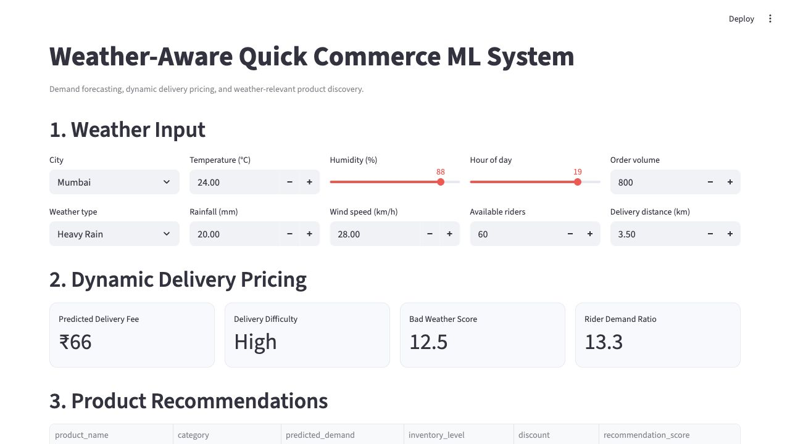

# Weather-Aware Demand Forecasting, Dynamic Pricing, and Product Recommendation Engine for Quick Commerce

## Project Summary

This end-to-end machine learning project models how weather affects quick-commerce demand and delivery operations. It generates realistic synthetic data, forecasts product demand, predicts delivery fees, recommends weather-relevant products, and exposes the results through a Streamlit dashboard.

## Problem Statement

Quick-commerce businesses must estimate near-term product demand while balancing inventory, rider supply, delivery difficulty, and customer experience. Weather changes both product preferences and logistics. This project answers:

1. Which products are likely to sell under current weather conditions?
2. How many units of each product are expected to sell?
3. What delivery fee reflects current weather and logistics pressure?
4. Which in-stock products should be recommended to customers?

## Amazon and Quick-Commerce Relevance

This project is relevant to Amazon and quick commerce because instant delivery platforms must make real-time decisions using demand, inventory, rider availability, customer behavior, and external factors like weather. Weather can affect both sides of the marketplace: customer demand and delivery capacity. Heavy rain can increase delivery difficulty and reduce rider availability, while hot weather can increase demand for cold beverages and ice creams. By combining demand forecasting, dynamic delivery pricing, and weather-based product recommendations, this project demonstrates how machine learning can support business decisions in large-scale e-commerce and delivery systems.

## Dataset

`data/synthetic_quick_commerce_data.csv` contains 210 days, 5 Indian cities, and 44 products. Each row combines a date, city, product, weather record, price and discount, inventory, sales, rider supply, delivery distance, delivery time, and delivery fee.

The generator includes all required columns plus optional customer segment, competitor price, campaign, stockout, and festival fields.

## Synthetic Data Generation

- Daily city weather uses seasonal temperature, city-specific humidity, monsoon probabilities, rainfall, and wind.
- Hot weather boosts cold beverages, frozen desserts, water, ORS, and electrolyte products.
- Rain boosts hot beverages, snacks, quick meals, and rain essentials; severe rain reduces broad delivery volume.
- Cold weather boosts hot beverages and soup-oriented quick meals.
- Rider availability falls in rain, heavy rain, wind, and extreme heat.
- Delivery time rises with distance, rainfall, wind, and rider demand pressure.
- Delivery fee follows the requested weather/logistics formula and is capped between ₹15 and ₹100.
- Random seed `42` makes generation and training reproducible.

## ML Tasks

### Demand Forecasting

The demand target is `units_sold`. A Linear Regression baseline and Random Forest Regressor are compared using MAE, RMSE, and R². The best model by RMSE is saved to `models/demand_model.pkl`.

### Dynamic Delivery Pricing

The pricing target is `delivery_fee`. Linear Regression and Random Forest Regressor are compared with the same regression metrics. The best model is saved to `models/delivery_fee_model.pkl`.

### Product Recommendation

The hybrid recommender first selects categories relevant to the chosen weather. Products are then ranked by:

```text
0.45 × normalized predicted demand
+ 0.25 × normalized inventory
+ 0.20 × normalized discount
+ 0.10 × normalized historical popularity
```

## Feature Engineering

- Date: day of week, month, weekend, hour, and time bucket
- Weather: hot, cold, rainy, heavy rain, humid, and rain intensity
- Pricing: discount percentage, final price, and price after discount
- Logistics: rider demand ratio, delivery pressure, and bad weather score
- Popularity: product, category, and city-product average sales

Training uses the first 80% of dates and testing uses the last 20%. No random train-test split is used.

## Model Evaluation

After training, metrics are written to:

- `outputs/demand_model_metrics.json`
- `outputs/pricing_model_metrics.json`

The JSON files identify the best model and contain MAE, RMSE, and R² for every candidate.

## Dashboard

The Streamlit app provides:

- city and weather scenario inputs
- predicted delivery fee and delivery difficulty
- bad weather and rider pressure indicators
- top weather-relevant product recommendations
- top predicted products
- demand and delivery-fee weather charts
- hot-weather and rainy-weather product charts
- model comparison metrics

## Dashboard Screenshots



## How to Run

```bash
python -m venv .venv
source .venv/bin/activate
pip install -r requirements.txt
python src/data_generation.py
python src/train_demand_model.py
python src/train_pricing_model.py
python src/predict.py
streamlit run app.py
```

The default prediction command uses the requested Mumbai heavy-rain example. Generated predictions and recommendations are saved under `outputs/`.

## Folder Structure

```text
weather-aware-quick-commerce-ml/
├── data/
│   ├── raw/
│   ├── processed/
│   └── synthetic_quick_commerce_data.csv
├── notebooks/
│   └── exploration.ipynb
├── src/
│   ├── data_generation.py
│   ├── preprocessing.py
│   ├── feature_engineering.py
│   ├── train_demand_model.py
│   ├── train_pricing_model.py
│   ├── recommendation_engine.py
│   ├── evaluate.py
│   ├── predict.py
│   └── utils.py
├── models/
│   ├── demand_model.pkl
│   └── delivery_fee_model.pkl
├── outputs/
│   ├── demand_model_metrics.json
│   ├── pricing_model_metrics.json
│   ├── predictions.csv
│   └── weather_product_recommendations.csv
├── app.py
├── requirements.txt
└── README.md
```

## Future Improvements

- Integrate Open-Meteo or OpenWeatherMap.
- Use real order and inventory data.
- Add customer personalization and collaborative filtering.
- Add association-rule mining.
- Predict inventory stockouts.
- Optimize rider allocation.
- Include traffic data.
- Optimize for profit and customer conversion.
- Add confidence intervals.
- Deploy on Streamlit Cloud.
- Add model and data-drift monitoring.
